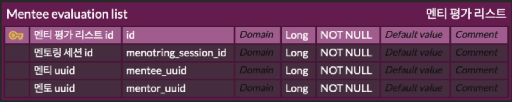
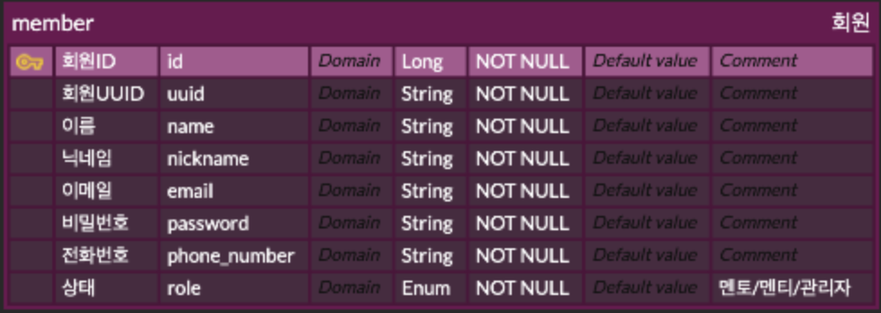
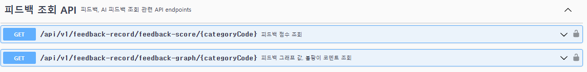
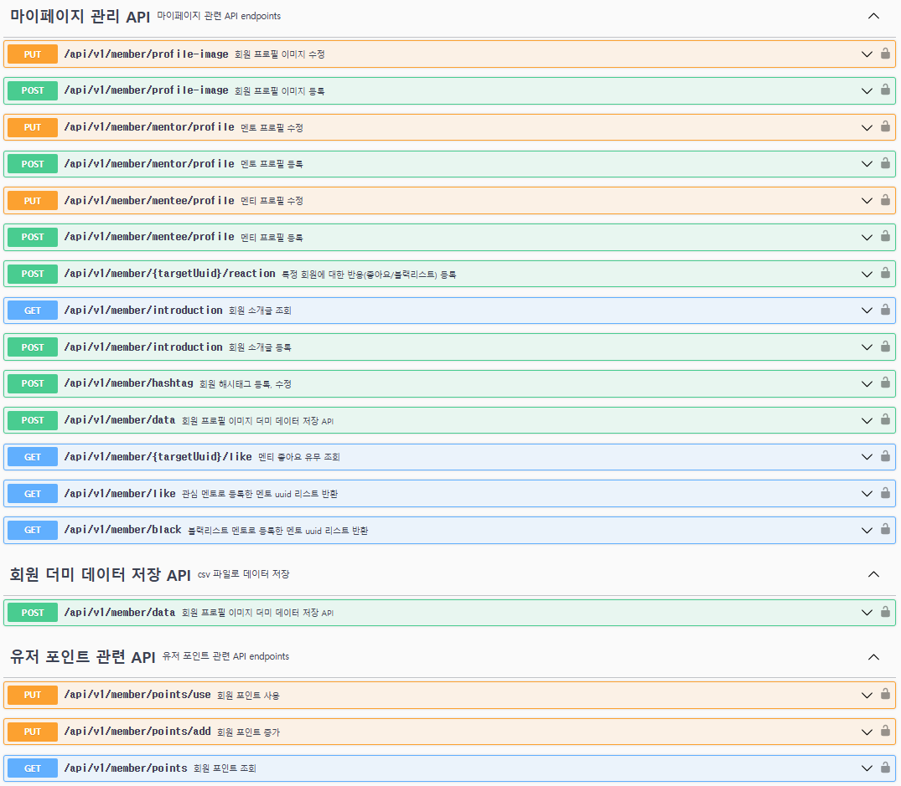
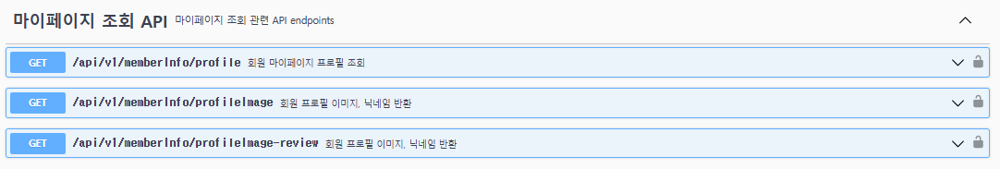

# 🔌 Adaptors


## 🗨모두를 연결하라! Adaptors!<br>

<div style="background-color: #f0f8ff; padding: 10px; border-radius: 5px;">
취업/이직에 특화된 쉽고 편리한 멘토링 플랫폼. <br>
AI피드백, 화상•채팅 서비스, 간편한 멘토링 생성 기능. <br>
대용량 트래픽에 대한 분산처리가 가능한 MSA(Micro Service Architecture) 구조의 프로젝트입니다. <br><br>
</div>

### 📌 특징

✔ EDA(Event Driven Design)를 적용, 카프카 이벤트 기반의 느슨한 결합</div><br>
✔ 각 서비스들의 독립적 DB구조에서 효율적 집계를 담당하는 Batch-service</div><br>
✔ 카프카 소스/싱크 커넥트를 사용한 CDC 기반 데이터 동기화 처리</div><br>
✔ CQRS (Command and Query Responsibility Segregation) 적용</div><br>
✔ 헥사고날 아키텍처를 적용하여 기술 코드와 비즈니스 코드를 분리</div><br>
✔ 도메인 로직에 집중하여 기술적 요구사항에 빠르게 대응</div>

<hr>

- **개발 기간** : 2024.10.07 ~ 2024.12.15 (11주)
- **플랫폼** : Web
- **개발 인원** : 9명 <br><br>

## 🔎 목차

<div align="center">

### <a href="#techStack">🛠️ 기술 스택</a>

### <a href="#systemArchitecture">🌐 시스템 아키텍처</a>

### <a href="#skills">📲 기능 구성</a>

### <a href="#directories">📂 디렉터리 구조</a>

### <a href="#projectDeliverables">📦 프로젝트 산출물</a>

### <a href="#developers">🌟 팀원 구성</a>

</div>
<br>

## 🛠️ 기술 스택

<a name="techStack"></a>

### Frontend

<div align="center">

<br>


<br>


<br/>


</div>

- **Language**
  - TypeScript ^5.3.3
- **Runtime Environment**
  - Node.js >=18
- **Framework**
  - Next.js 14.2.6
- **Library**
  - React.js 19.0.0 ,Shadcn UI, Tailwind CSS ^3.4.1, fullcalendar ^6.1.4, turbo ^2.1.3, framer-motion ^11.11.10, openvidu-browser ^2.30.1, recharts ^2.14.1, sweetalert2 ^11.4.8, swiper ^11.1.14, zod ^3.23.8
- **IDE**
  - Visual Studio Code 1.93.1
- **Deploy**
  - k8s

### Backend

<div align="center">


<br>


</div>

- **Framework**
  - Spring Boot 3.3.5
- **Library**
  - Spring Data JPA, Querydsl 5.0.0
- **Database**
  - MySQL 8.0.38, Redis 7.2
- **IDE**
  - IntelliJ IDEA 2024.2 (Ultimate Edition), Visual Studio Code 1.93.1
- **Build Tool**
  - Gradle 8.8.0

### DevOps

<div align="center">

           

</div>

### Collaboration

<div align="center">


</div>

<br>

## 🌐 시스템 아키텍처


<br>

## 📲 주요 기능

<a name="skills"></a>

## 🏃‍♂️로그인 페이지

|       |                                                                                                                                    |
| -------------------------------- | ------------------------------------------------------------------------------------------------------------------------------------------------------------- |
| 랜딩페이지                       | 로그인&카카오로그인                                                                                                                                           |
| 최초로 실행될 때 보여지는 페이지 | 회원가입을 통해 회원가입을 진행할 수 있으며, 카카오 로그인 또한 할 수 있습니다. 카카오 로그인 성공 시, 서비스에 등록된 회원이 아니라면 회원가입을 진행합니다. |

|  |  |
| --------------------------- | --------------------------- |
| 회원가입페이지              | 아이디&비밀번호 찾기 페이지 |
| 음                          | 음                          |

## 🕒메인 페이지(Web)

|  |                                   |
| ------------------------------------------------------------------------------------------------- | ---------------------------------------------------------------------------------------------------------------------------------- |
| 메인페이지&베스트 멘토링&인기 멘토                                                                | ELASTIC SEARCH&멘토링 리스트 페이지                                                                                                |
| 메인페이지에서 현재 베스트 멘토링과 인기 멘토에 대한 정보를 얻을 수 있습니다.                     | ELASTIC SEARCH를 통해 멘토링을 보다 정확하게 검색가능하며 검색 결과에 해당하는 멘토링들을 볼 수 있으며, 상세보기를 할 수 있습니다. |

|                                                                                                                               |                                                                               |
| ------------------------------------------------------------------------------------------------------------------------------------------------------- | ------------------------------------------------------------------------------------------------------- |
| 멘토링 상세보기 페이지                                                                                                                                  | 멘토 리스트 페이지 & 멘토 상세보기 페이지                                                               |
| 멘토링에 대한 정보를 보다 상세히 확인 할 수 잇습니다. 멘토링에 대한 열려 있는 세션을 확인할 수 있으며 원하는 시간에 신청하여 멘토링을 들을 수 있습니다. | 어떤 멘토들이 있는지 확인 할 수 있습니다. 각 멘토들이 어떤 멘토링을 진행하고 있는지 확인할 수 있습니다. |

## 📑 AI 피드백 페이지 & 마이페이지 (Web)

|  |                   |
| ------------------------------------------------------------------------------------------------- | ------------------------------------------- |
| AI 피드백 페이지                                                                                  | 마이페이지 - 피드백 결과보기                |
| 바로 피드백을 받기를 원한다면 AI 피드백을 사용할 수 있습니다.                                     | AI 피드백 진행한 결과를 확인할 수 있습니다. |

|                               |  |
| ------------------------------------------------------- | -------------------------- |
| 충전페이지(카카오페이)                                  | 머넣지                     |
| 카카오페이를 사용해 볼트(포인트)를 충전 할 수 있습니다. | 머넣지                     |

## 🕒메인 페이지(Electron)

|                         |                                                                   |
| ------------------------------------------------- | ------------------------------------------------------------------------------------------- |
| 멘토링리스트 & 상세보기 페이지                    | 마이페이지                                                                                  |
| 자신이 진행하고 있는 멘토링을 확인할 수 있습니다. | 개인정보수정, 멘토소개 글 등을 수정할 수 있고 진행한 멘토링 세션에 대해 확인할 수 있습니다. |

|  |  |
| ------------------------------------------------------------------------------------------------- | ------------------------------------------------------------------------------------------------- |
| 채팅 페이지                                                                                       | 알림 보기                                                                                         |
| 멘토링 세션간에 대화했던 내용을 확인 할 수 있습니다.                                              | 다가오는 일정, 멘토링에 대한 리뷰 작성에 대한 알림을 받을 수 있습니다.                            |

## 👨🏼‍🤝‍👨🏼 볼트 & 스케쥴 페이지 (Electron)

|  |  |
| ------------------------------------------------------------------------------------------------- | ------------------------------------------------------------------------------------------------- |
| 볼트 페이지(정산)                                                                                 | 스케쥴 페이지                                                                                     |
| 멘토링을 통해 발생한 수익(볼트)을 정산할 수 있습니다.                                             | 진행해야 하는 멘토링 세션들에 대해 달력으로 스케쥴을 확인할 수 있습니다.                          |

## 💭화상회의 페이지(멘토, 멘티)

|  |                       |
| ------------------------------------------------------------------------------------------------- | ----------------------------------------------- |
| 화상회의 페이지(멘토)                                                                             | 화상회의 페이지(멘티)                           |
| 멘토링을 진행할 화상회의 페이지(멘토용) 입니다.                                                   | 멘토링을 진행할 화상회의 페이지(멘티용) 입니다. |

## 📂 디렉터리 구조

<details>
  <summary>
    Frontend
  </summary>

<!-- todo -->

```
📂adaptors_fe_monorepo
 ┣ 📂.github
 ┣ 📂.husky
 ┣ 📂.turbo
 ┣ 📂apps
 ┃  ┣ 📂admin
 ┃  ┃  ┣ 📂.turbo
 ┃  ┃  ┣ 📂public
 ┃  ┃  ┗ 📂src
 ┃  ┃    ┣ 📂actions
 ┃  ┃     ┣ 📂app
 ┃  ┃     ┣ 📂components
 ┃  ┃     ┣ 📂config
 ┃  ┃     ┗ 📂store
 ┃  ┃
 ┃  ┃
 ┃  ┗ 📂web
 ┃     ┣ 📂.turbo
 ┃     ┣ 📂public
 ┃     ┗ 📂src
 ┃        ┣ 📂actions
 ┃        ┣ 📂app
 ┃        ┣ 📂components
 ┃        ┗ 📂store
 ┃
 ┃
 ┃
 ┗ 📂pakages
   ┣ 📂config-eslint
   ┣ 📂config-tailwind
   ┣ 📂config-typescript
   ┗ 📂ui
      ┗ 📂src
         ┣ 📂components
         ┣ 📂hooks
         ┣ 📂lib
         ┗ 📂types
```

</details>

<details>
  <summary>
    Backend
  </summary>

```
📦 command service
📂src
├── 📂main
│   ├── 📂java
│   │   └── 📂adaptors
│   │       └── 📂alarm_service
│   │           ├── AlarmServiceApplication.java
│   │           ├── 📂alarm
│   │           │   ├── 📂adaptor
│   │           │   │   ├── 📂in
│   │           │   │   │   ├── 📂consumer
│   │           │   │   │   │   ├── KafkaConsumer.java
│   │           │   │   │   │   ├── 📂config
│   │           │   │   │   │   │   └── KafkaConsumerConfig.java
│   │           │   │   │   │   ├── 📂mapper
│   │           │   │   │   │   │   └── ConsumerVoMapper.java
│   │           │   │   │   │   └── 📂vo
│   │           │   │   │   │       ├── ConsumerCreateMentoringVo.java
│   │           │   │   │   │       ├── ConsumerCreateReviewVo.java
│   │           │   │   │   │       ├── ConsumerSessionPayVo.java
│   │           │   │   │   │       └── ConsumerSessionRegisterVo.java
│   │           │   │   │   └── 📂rest
│   │           │   │   │       ├── AlarmController.java
│   │           │   │   │       └── 📂mapper
│   │           │   │   │           └── RestVoMapper.java
│   │           │   │   └── 📂out
│   │           │   │       └── 📂mongo
│   │           │   │           ├── 📂adaptor
│   │           │   │           │   └── AlarmAdaptor.java
│   │           │   │           ├── 📂config
│   │           │   │           │   └── MongoConfig.java
│   │           │   │           ├── 📂document
│   │           │   │           │   └── AlarmDocument.java
│   │           │   │           ├── 📂dto
│   │           │   │           │   └── AlarmReadResponseDto.java
│   │           │   │           ├── 📂mapper
│   │           │   │           │   └── AlarmDocumentMapper.java
│   │           │   │           └── 📂repository
│   │           │   │               ├── AlarmMongoRepository.java
│   │           │   │               └── 📂custom
│   │           │   │                   ├── AlarmMongoRepositoryCustom.java
│   │           │   │                   └── AlarmMongoRepositoryCustomImpl.java
│   │           │   ├── 📂application
│   │           │   │   ├── 📂mapper
│   │           │   │   │   └── AlarmQueryMapper.java
│   │           │   │   ├── 📂port
│   │           │   │   │   ├── 📂in
│   │           │   │   │   │   ├── AlarmUseCase.java
│   │           │   │   │   │   └── 📂dto
│   │           │   │   │   │       ├── 📂consumer
│   │           │   │   │   │       │   └── AlarmPortInDto.java
│   │           │   │   │   │       └── 📂rest
│   │           │   │   │   │           └── RestReadAlarmDto.java
│   │           │   │   │   └── 📂out
│   │           │   │   │       ├── AlarmRepositoryPort.java
│   │           │   │   │       └── 📂dto
│   │           │   │   │           ├── AlarmCreateQueryDto.java
│   │           │   │   │           └── AlarmReadQueryDto.java
│   │           │   │   └── 📂service
│   │           │   │       └── AlarmService.java
│   │           │   └── 📂domain
│   │           │       ├── 📂model
│   │           │       │   ├── AlarmDomain.java
│   │           │       │   └── AlarmType.java
│   │           │       └── 📂service
│   │           │           └── AlarmDomainService.java
│   │           └── 📂global
│   │               ├── 📂config
│   │               │   └── SwaggerConfig.java
│   │               ├── 📂document
│   │               │   └── BaseDocument.java
│   │               ├── 📂exception
│   │               │   ├── BaseException.java
│   │               │   ├── BaseExceptionHandler.java
│   │               │   └── BaseExceptionHandlerFilter.java
│   │               ├── 📂response
│   │               │   ├── BaseResponse.java
│   │               │   └── BaseResponseStatus.java
│   │               └── 📂utils
│   │                   ├── AlarmScheduler.java
│   │                   ├── MessageGenerator.java
│   │                   ├── MessageTemplates.java
│   │                   ├── SseEmitterManager.java
│   │                   └── UuidGenerator.java
│   └── 📂resources
│       └── application.yml
```

```
📂src
├── 📂main
│   ├── 📂java
│   │   └── 📂com
│   │       └── 📂example
│   │           └── 📂section
│   │               ├── SectionApplication.java
│   │               ├── 📂application
│   │               │   ├── MentoringManagementService.java
│   │               │   ├── MentoringManagementServiceImpl.java
│   │               │   ├── MentoringService.java
│   │               │   ├── MentoringServiceImpl.java
│   │               │   ├── SessionService.java
│   │               │   └── SessionServiceImpl.java
│   │               ├── 📂common
│   │               │   ├── 📂Exception
│   │               │   │   ├── BaseException.java
│   │               │   │   └── BaseExceptionHandler.java
│   │               │   ├── 📂entity
│   │               │   │   ├── BaseResponse.java
│   │               │   │   └── BaseResponseStatus.java
│   │               │   └── 📂utils
│   │               │       ├── CategoryCodeGenerator.java
│   │               │       ├── CursorPage.java
│   │               │       ├── DateLocalDateConverter.java
│   │               │       └── PurchaseCodeGenerator.java
│   │               ├── 📂dto
│   │               │   └── 📂out
│   │               │       ├── CorrectedSearchResultResponseDto.java
│   │               │       ├── MainMentoringResponseDto.java
│   │               │       ├── MentoringCategoryResponseDto.java
│   │               │       ├── MentoringCoreInfoResponseDto.java
│   │               │       ├── MentoringHashTagResponseDto.java
│   │               │       ├── MentoringResponseDto.java
│   │               │       ├── MentoringReusableResponseDto.java
│   │               │       ├── MentoringSessionResponseDto.java
│   │               │       ├── SessionListResponseDto.java
│   │               │       ├── SessionRoomResponseDto.java
│   │               │       └── SessionUserResponseDto.java
│   │               ├── 📂elasticSearch
│   │               │   ├── 📂application
│   │               │   │   ├── ElasticsearchService.java
│   │               │   │   ├── ElasticsearchServiceImpl.java
│   │               │   │   └── HangulUtils.java
│   │               │   ├── 📂config
│   │               │   │   └── ElasticsearchConfig.java
│   │               │   ├── 📂dto
│   │               │   │   └── SuggestedNameResponseDto.java
│   │               │   ├── 📂entity
│   │               │   │   └── EsMentoring.java
│   │               │   ├── 📂infrastructure
│   │               │   │   └── MentoringElasticRepository.java
│   │               │   └── 📂presentation
│   │               │       └── ElasticController.java
│   │               ├── 📂entity
│   │               │   ├── Mentoring.java
│   │               │   ├── MentoringSession.java
│   │               │   └── vo
│   │               │       └── SessionUser.java
│   │               ├── 📂infrastructure
│   │               │   ├── MentoringMongoRepository.java
│   │               │   ├── MentoringSessionMongoRepository.java
│   │               │   └── 📂custom
│   │               │       ├── CustomMentoringRepository.java
│   │               │       ├── CustomMentoringRepositoryImpl.java
│   │               │       ├── CustomSessionRepository.java
│   │               │       └── CustomSessionRepositoryImpl.java
│   │               ├── 📂messagequeue
│   │               │   ├── KafkaConsumer.java
│   │               │   ├── KafkaConsumerConfig.java
│   │               │   └── 📂messageIn
│   │               │       ├── AfterHashtag.java
│   │               │       ├── AfterSessionUserOutDto.java
│   │               │       ├── CancelSessionUserMessage.java
│   │               │       ├── MentoringAddAfterOutDto.java
│   │               │       ├── MentoringCategoryAfterOutDto.java
│   │               │       ├── MentoringEditRequestOutDto.java
│   │               │       ├── MentoringHashTagAfterOutDto.java
│   │               │       ├── MentoringOverviewDto.java
│   │               │       ├── MentoringSessionAddAfterOutDto.java
│   │               │       ├── ReRegisterSessionUserMessage.java
│   │               │       ├── SessionAddAfterOutDto.java
│   │               │       ├── SessionConfirmedMessage.java
│   │               │       ├── SessionCreatedAfterOutDto.java
│   │               │       └── Status.java
│   │               ├── 📂presentation
│   │               │   ├── MentoringController.java
│   │               │   ├── MentoringManagementController.java
│   │               │   └── SessionController.java
│   │               └── 📂vo
│   │                   └── InputWordVo.java
│   └── resources
│       ├── application.yml
│       ├── ca.crt
│       └── caDeply.crt
```

</details>

<details>
  <summary>
    DevOps
  </summary>

```
📦DevOps
┣ 📔Back
┃  ┣ 📔aifeedback-service
┃  ┃  ┣ Chart.yaml
┃  ┃  ┣ sealed-secret.yaml
┃  ┃  ┣ secret.yaml
┃  ┃  ┣ templates
┃  ┃  ┃   ┣ _helpers.tpl
┃  ┃  ┃   ┣ configmap.yaml
┃  ┃  ┃   ┣ deployment.yaml
┃  ┃  ┃   ┣ secrets.yaml
┃  ┃  ┃   ┗ svc.yaml
┃  ┃  ┗ values.yaml
┃  ┣ 📔auth-service
┃  ┃  ┣ Chart.yaml
┃  ┃  ┣ sealed-secret.yaml
┃  ┃  ┣ secret.yaml
┃  ┃  ┣ templates
┃  ┃  ┃  ┣ _helpers.tpl
┃  ┃  ┃  ┣ configmap.yml
┃  ┃  ┃  ┣ deployment.yml
┃  ┃  ┃  ┣ secrets.yml
┃  ┃  ┃  ┗ svc.yml
┃  ┃  ┗ values.yaml
┃  ┣ 📔batch-service
┃  ┃  ┣ Chart.yaml
┃  ┃  ┣ sealed-secret.yaml
┃  ┃  ┣ secret.yaml
┃  ┃  ┣ templates
┃  ┃  ┃  ┣ _helpers.tpl
┃  ┃  ┃  ┣ configmap.yaml
┃  ┃  ┃  ┣ deployment.yaml
┃  ┃  ┃  ┣ secrets.yaml
┃  ┃  ┃  ┗ svc.yaml
┃  ┃  ┗ values.yaml
┃  ┣ 📔category-service
┃  ┃  ┣ Chart.yaml
┃  ┃  ┣ sealed-secret.yaml
┃  ┃  ┣ secret.yaml
┃  ┃  ┣ templates
┃  ┃  ┃  ┣ _helpers.tpl
┃  ┃  ┃  ┣ configmap.yaml
┃  ┃  ┃  ┣ deployment.yaml
┃  ┃  ┃  ┣ secrets.yaml
┃  ┃  ┃  ┗ svc.yaml
┃  ┃  ┗ values.yaml
┃  ┣ 📔feedback-service
┃  ┃  ┣ Chart.yaml
┃  ┃  ┣ sealed-secret.yaml
┃  ┃  ┣ secret.yaml
┃  ┃  ┣ templates
┃  ┃  ┃  ┣ _helpers.tpl
┃  ┃  ┃  ┣ configmap.yaml
┃  ┃  ┃  ┣ deployment.yaml
┃  ┃  ┃  ┣ secrets.yaml
┃  ┃  ┃  ┗ svc.yaml
┃  ┃  ┗ values.yaml
┃  ┣ 📔hashtag-service
┃  ┃  ┣ Chart.yaml
┃  ┃  ┣ sealed-secret.yaml
┃  ┃  ┣ secret.yaml
┃  ┃  ┣ templates
┃  ┃  ┃  ┣ _helpers.tpl
┃  ┃  ┃  ┣ configmap.yaml
┃  ┃  ┃  ┣ deployment.yaml
┃  ┃  ┃  ┣ secrets.yaml
┃  ┃  ┃  ┗ svc.yaml
┃  ┃  ┗ values.yaml
┃  ┣ 📔member-service
┃  ┃  ┣ Chart.yaml
┃  ┃  ┣ sealed-secret.yaml
┃  ┃  ┣ secret.yaml
┃  ┃  ┣ templates
┃  ┃  ┃  ┣ _helpers.tpl
┃  ┃  ┃  ┣ configmap.yaml
┃  ┃  ┃  ┣ deployment.yaml
┃  ┃  ┃  ┣ secrets.yaml
┃  ┃  ┃  ┗ svc.yaml
┃  ┃  ┗ values.yaml
┃  ┣ 📔mentoring-service
┃  ┃  ┣ Chart.yaml
┃  ┃  ┣ sealed-secret.yaml
┃  ┃  ┣ secret-values.yaml
┃  ┃  ┣ secret.yaml
┃  ┃  ┣ templates
┃  ┃  ┃  ┣ _helpers.tpl
┃  ┃  ┃  ┣ configmap.yaml
┃  ┃  ┃  ┣ deployment.yaml
┃  ┃  ┃  ┣ secrets.yaml
┃  ┃  ┃  ┗ svc.yaml
┃  ┃  ┗ values.yaml
┃  ┣ 📔mongo
┃  ┃  ┣ 📔alarm-service
┃  ┃  ┃  ┣ Chart.yaml
┃  ┃  ┃  ┣ sealed-secret.yaml
┃  ┃  ┃  ┣ secret.yaml
┃  ┃  ┃  ┣ templates
┃  ┃  ┃  ┃  ┣ _helpers.tpl
┃  ┃  ┃  ┃  ┣ configmap.yaml
┃  ┃  ┃  ┃  ┣ deployment.yaml
┃  ┃  ┃  ┃  ┣ secrets.yaml
┃  ┃  ┃  ┃  ┗ svc.yaml
┃  ┃  ┃  ┗ values.yaml
┃  ┃  ┣ 📔chat-query-service
┃  ┃  ┃  ┣ Chart.yaml
┃  ┃  ┃  ┣ sealed-secret.yaml
┃  ┃  ┃  ┣ secret.yaml
┃  ┃  ┃  ┣ templates
┃  ┃  ┃  ┃   ┣ _helpers.tpl
┃  ┃  ┃  ┃   ┣ configmap.yaml
┃  ┃  ┃  ┃   ┣ deployment.yaml
┃  ┃  ┃  ┃   ┣ secrets.yaml
┃  ┃  ┃  ┃   ┗ svc.yaml
┃  ┃  ┃  ┗ values.yaml
┃  ┃  ┣ 📔chat-service
┃  ┃  ┃  ┣ Chart.yaml
┃  ┃  ┃  ┣ sealed-secret.yaml
┃  ┃  ┃  ┣ secret.yaml
┃  ┃  ┃  ┣ templates
┃  ┃  ┃  ┃   ┣ _helpers.tpl
┃  ┃  ┃  ┃   ┣ configmap.yaml
┃  ┃  ┃  ┃   ┣ deployment.yaml
┃  ┃  ┃  ┃   ┣ secrets.yaml
┃  ┃  ┃  ┃   ┗ svc.yaml
┃  ┃  ┃  ┗ values.yaml
┃  ┃  ┣ 📔feedback-query-service
┃  ┃  ┃  ┣ Chart.yaml
┃  ┃  ┃  ┣ sealed-secret.yaml
┃  ┃  ┃  ┣ secret.yaml
┃  ┃  ┃  ┣ templates
┃  ┃  ┃  ┃   ┣ _helpers.tpl
┃  ┃  ┃  ┃   ┣ configmap.yaml
┃  ┃  ┃  ┃   ┣ deployment.yaml
┃  ┃  ┃  ┃   ┣ secrets.yaml
┃  ┃  ┃  ┃   ┗ svc.yaml
┃  ┃  ┃  ┗ values.yaml
┃  ┃  ┣ 📔member-query-service
┃  ┃  ┃  ┣ Chart.yaml
┃  ┃  ┃  ┣ sealed-secret.yaml
┃  ┃  ┃  ┣ secret.yaml
┃  ┃  ┃  ┣ templates
┃  ┃  ┃  ┃   ┣ _helpers.tpl
┃  ┃  ┃  ┃   ┣ configmap.yaml
┃  ┃  ┃  ┃   ┣ deployment.yaml
┃  ┃  ┃  ┃   ┣ secrets.yaml
┃  ┃  ┃  ┃   ┗ svc.yaml
┃  ┃  ┃  ┗ values.yaml
┃  ┃  ┣ 📔mentoring-query-service
┃  ┃  ┃  ┣ Chart.yaml
┃  ┃  ┃  ┣ sealed-secret.yaml
┃  ┃  ┃  ┣ secret.yaml
┃  ┃  ┃  ┣ templates
┃  ┃  ┃  ┃   ┣ _helpers.tpl
┃  ┃  ┃  ┃   ┣ configmap.yaml
┃  ┃  ┃  ┃   ┣ deployment.yaml
┃  ┃  ┃  ┃   ┣ secrets.yaml
┃  ┃  ┃  ┃   ┗ svc.yaml
┃  ┃  ┃  ┗ values.yaml
┃  ┃  ┣ 📔prompt-service
┃  ┃  ┃  ┣ Chart.yaml
┃  ┃  ┃  ┣ sealed-secret.yaml
┃  ┃  ┃  ┣ secret.yaml
┃  ┃  ┃  ┣ templates
┃  ┃  ┃  ┃   ┣ _helpers.tpl
┃  ┃  ┃  ┃   ┣ configmap.yaml
┃  ┃  ┃  ┃   ┣ deployment.yaml
┃  ┃  ┃  ┃   ┣ secrets.yaml
┃  ┃  ┃  ┃   ┗ svc.yaml
┃  ┃  ┃  ┗ values.yaml
┃  ┃  ┣ 📔review-query-service
┃  ┃  ┃  ┣ Chart.yaml
┃  ┃  ┃  ┣ sealed-secret.yaml
┃  ┃  ┃  ┣ secret.yaml
┃  ┃  ┃  ┣ templates
┃  ┃  ┃  ┃   ┣ _helpers.tpl
┃  ┃  ┃  ┃   ┣ configmap.yaml
┃  ┃  ┃  ┃   ┣ deployment.yaml
┃  ┃  ┃  ┃   ┣ secrets.yaml
┃  ┃  ┃  ┃   ┗ svc.yaml
┃  ┃  ┃  ┗ values.yaml
┃  ┃  ┗ 📔session-request-query-service
┃  ┃      ┣ Chart.yaml
┃  ┃      ┣ sealed-secret.yaml
┃  ┃      ┣ secret.yaml
┃  ┃      ┣ templates
┃  ┃      ┃  ┣ _helpers.tpl
┃  ┃      ┃  ┣ configmap.yaml
┃  ┃      ┃  ┣ deployment.yaml
┃  ┃      ┃  ┣ secrets.yaml
┃  ┃      ┃  ┗ svc.yaml
┃  ┃      ┗ values.yaml
┃  ┣ 📔openvidu-service
┃  ┃   ┣ Chart.yaml
┃  ┃   ┣ sealed-secret.yaml
┃  ┃   ┣ secret.yaml
┃  ┃   ┣ templates
┃  ┃   ┃  ┣ _helpers.tpl
┃  ┃   ┃  ┣ configmap.yaml
┃  ┃   ┃  ┣ deployment.yaml
┃  ┃   ┃  ┣ secrets.yaml
┃  ┃   ┃  ┗ svc.yaml
┃  ┃   ┗ values.yaml
┃  ┣ 📔payment-service
┃  ┃   ┣ Chart.yaml
┃  ┃   ┣ sealed-secret.yaml
┃  ┃   ┣ secret.yaml
┃  ┃   ┣ templates
┃  ┃   ┃  ┣ _helpers.tpl
┃  ┃   ┃  ┣ configmap.yaml
┃  ┃   ┃  ┣ deployment.yaml
┃  ┃   ┃  ┣ secrets.yaml
┃  ┃   ┃  ┗ svc.yaml
┃  ┃   ┗ values.yaml
┃  ┣ 📔review-service
┃  ┃   ┣ Chart.yaml
┃  ┃   ┣ sealed-secret.yaml
┃  ┃   ┣ secret.yaml
┃  ┃   ┣ templates
┃  ┃   ┃  ┣ _helpers.tpl
┃  ┃   ┃  ┣ configmap.yaml
┃  ┃   ┃  ┣ deployment.yaml
┃  ┃   ┃  ┣ secrets.yaml
┃  ┃   ┃  ┗ svc.yaml
┃  ┃   ┗ values.yaml
┃   ┗ 📔session-request-service
┃       ┣ Chart.yaml
┃       ┣ sealed-secret.yaml
┃       ┣ secret.yaml
┃       ┣ templates
┃       ┃  ┣ _helpers.tpl
┃       ┃  ┣ configmap.yaml
┃       ┃  ┣ deployment.yaml
┃       ┃  ┣ secrets.yaml
┃       ┃  ┗ svc.yaml
┃       ┗ values.yaml
┣ 📔front-server
┃  ┣ Chart.yaml
┃  ┣ sealed-secret.yaml
┃  ┣ secret.yaml
┃  ┣ templates
┃  ┃   ┣ _helpers.tpl
┃  ┃   ┣ alb-ingress.yaml
┃  ┃   ┣ deployment.yaml
┃  ┃   ┣ secrets.yaml
┃  ┃   ┗ svc.yaml
┃  ┗ values.yaml
```

</details>
<br>

## 📦 데브옵스 기술스택

| 분류           | 기술 스택                                                      |
| -------------- | -------------------------------------------------------------- |
| Common         | GitHub, Notion, GitOps                                         |
| Infrastructure | AWS (EKS, ECR, ALB), Kubernetes, Helm, Kong                    |
| CI/CD          | GitHub Actions, ArgoCD, Docker(27.2.0), Docker-compose(v2.5.0) |
| Database       | MySQL(24.04.2), PostgreSQL, MongoDB, Redis(7.2.5)              |
| Message Queue  | Apache Kafka, Kafka Connect                                    |

## 📦 프로젝트 산출물

<a name="projectDeliverables"></a>

<h3>💡 이벤트 스토밍</h3>

<details>
  <summary>
    회원
  </summary>


</details>

<details>
  <summary>
    멘토링
  </summary>


</details>

<details>
  <summary>
    결제
  </summary>


</details>

<details>
  <summary>
    리뷰
  </summary>


</details>

<details>
  <summary>
    피드백
  </summary>


</details>

<details>
  <summary>
    알림
  </summary>


</details>

<details>
  <summary>
    채팅
  </summary>


</details>

<details>
  <summary>
    카테고리
  </summary>


</details>

<details>
  <summary>
    화상
  </summary>


</details>

<details>
  <summary>
    배치
  </summary>


</details>
</div>

<br>

<h3>🗄️ ERD</h3>

<details>
  <summary>
    리뷰
  </summary>


</details>

<details>
  <summary>
    멘토링
  </summary>


</details>

<details>
  <summary>
    멘토 프로필
  </summary>


</details>

<details>
  <summary>
    멘토 평가 리스트
  </summary>



</details>

<details>
  <summary>
    멘티 프로필
  </summary>


</details>

<details>
  <summary>
    세션 유저 리스트
  </summary>


</details>

<details>
  <summary>
    소셜 로그인
  </summary>


</details>

<details>
  <summary>
    알림
  </summary>


</details>

<details>
  <summary>
    채팅
  </summary>


</details>

<details>
  <summary>
    카카오페이
  </summary>


</details>

<details>
  <summary>
    카테고리
  </summary>


</details>

<details>
  <summary>
    환전
  </summary>


</details>

<details>
  <summary>
    회원
  </summary>



</details>

<details>
  <summary>
    회원 볼트 결제내역
  </summary>


</details>

<details>
  <summary>
    회원 볼트 세션 결제내역
  </summary>


</details>

<details>
  <summary>
    회원 좋아요 싫어요
  </summary>


</details>

<details>
  <summary>
    회원 해시태그
  </summary>


</details>

<br>

<h3><a href="#" target="_blank">📅 WBS</a></h3>

<a href="https://docs.google.com/spreadsheets/d/1-uyLNsqlIY9ioqTycblgH-npXIrRUT7gwRd6SWAMFIk/edit?gid=0#gid=0"> WBS

<br>

<h3><a href="#" target="_blank">📋 요구사항 정의서</a></h3>

<br>

<h3><a href="#" target="_blank">📡 API 명세서</a></h3>

<details>
  <summary>
    aifeedback-service
  </summary>


</details>

<details>
  <summary>
    alarm-service
  </summary>


</details>

<details>
  <summary>
    auth-service
  </summary>


</details>

<details>
  <summary>
    batch-service
  </summary>


</details>

<details>
  <summary>
    category-service
  </summary>


</details>

<details>
  <summary>
    chat-service
  </summary>


</details>

<details>
  <summary>
    chat-query-service
  </summary>


</details>

<details>
  <summary>
    feedback-query-service
  </summary>



</details>

<details>
  <summary>
    feddback-score-service
  </summary>


</details>

<details>
  <summary>
    hashtag-service
  </summary>


</details>

<details>
  <summary>
    member-service
  </summary>



</details>

<details>
  <summary>
    member-query-service
  </summary>



</details>

<details>
  <summary>
    mentoring-service
  </summary>


</details>

<details>
  <summary>
    mentoring-query-service
  </summary>


</details>

<details>
  <summary>
    openvidu-server
  </summary>


</details>

<details>
  <summary>
    payment-service
  </summary>


</details>

<details>
  <summary>
    prompt-service
  </summary>


</details>

<details>
  <summary>
    review-service
  </summary>


</details>

<details>
  <summary>
    review-query-service
  </summary>


</details>

<details>
  <summary>
    session-request-service
  </summary>


</details>

<details>
  <summary>
    session-request-query-service
  </summary>


</details>

<br>

## 🌟 팀원 구성

<a name="developers"></a>

<div align="center">
<table align="center" width="90%" border="1">
  <tbody>
    <tr>
      <td height="200px" align="center"> 
        <a href="https://github.com/dani001024">
           
          <span style="display: block; text-align: center;"> <br> 김예진 <br>(Frontend)</span>
        </a>
      </td>
      <td height="200px" align="center">
        <a href="https://github.com/seolchanwoo">
           
          <span style="display: block; text-align: center;"> <br> 설찬우 <br>(Frontend)</span>
        </a>
      </td>
      <td height="200px" align="center">
        <a href="https://github.com/AndreaStudy">
           
          <span style="display: block; text-align: center;"> <br> 정훈석 <br>(Frontend)</span>
        </a>
      </td> 
    </tr>
    <tr>
      <td height="200px" align="center">
        <a href="https://github.com/kang-subin">
           
          <span style="display: block; text-align: center;"> <br> 강수빈 <br>(Backend)</span>
        </a>
      </td>
      <td height="200px" align="center">
        <a href="https://github.com/everydayday">
           
          <span style="display: block; text-align: center;"> <br> 김대희 <br>(Backend)</span>
        </a>
      </td>
      <td height="200px" align="center">
        <a href="https://github.com/Seong-Tae-Kim">
           
          <span style="display: block; text-align: center;"> <br> 김성태 <br>(Backend)</span>
        </a>
      </td>
    </tr>
    <tr>
      <td height="200px" align="center">
        <a href="https://github.com/Jung-Hey">
           
          <span style="display: block; text-align: center;"> <br> 허정현 <br>(Backend)</span>
        </a>
      </td>
      <td height="200px" align="center">
        <a href="https://github.com/Baek-Seungyeop">
           
          <span style="display: block; text-align: center;"> <br> 백승엽 <br>(Backend&DevOps)</span>
        </a>
      </td>
      <td height="200px" align="center">
        <a href="https://github.com/daegwan00">
           
          <span style="display: block; text-align: center;"> <br> 오대관 <br>(DevOps)</span>
        </a>
      </td>
    </tr>
  </tbody>
</table>
</div>

</div>
<br>
